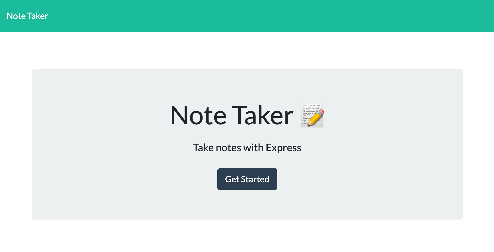
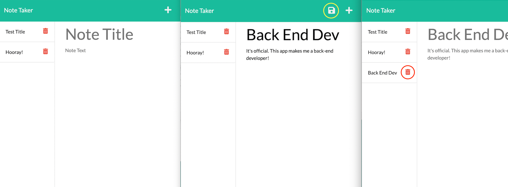

# noteTaker
    

## Description
noteTaker is a full-stack project that provides a UI in the browser that allows you to create and take notes, and then saves them on the back end.

This app is quite basic, only utilising one api route but uses three RESTful methods, being:

 - **Get**
 - **Post**, and
 - **Delete**

From this, users can create, and delete notes, as well as view existing notes.

noteTaker was created to be able to take efficient notes as well as to strengthen my full-stack skills.

From developing noteTaker, I have developed greater skills in back-end developement as well as with Express.js.

noteTaker was created with JavaScript, Node.js and Express.js.

## Table of Contents
- [noteTaker](#notetaker)
  - [Description](#description)
  - [Table of Contents](#table-of-contents)
  - [Installation](#installation)
  - [Usage](#usage)
    - [Using noteTaker](#using-notetaker)
    - [Taking a Note](#taking-a-note)
  - [Contribute to noteTaker](#contribute-to-notetaker)
  - [Tests](#tests)
  - [Questions](#questions)
  - [Credits](#credits)
    - [Tutorials](#tutorials)
    - [Third-Party Assets](#third-party-assets)
  - [License](#license)

## Installation
To develop and contribute to noteTaker, navigate to the directory you wish to store the app on your local machine in the terminal and run the first line of code below.

To simply use the app, [click here](https://notetaker-kbario.herokuapp.com/).

    git clone https://github.com/kbario/noteTaker.git

## Usage

### Using noteTaker

To open the app, follow the link https://notetaker-kbario.herokuapp.com/ . This will take you to the start-up page where you can click 'Get Started' which will take you to the note-taking part of the app.

### Taking a Note

On the note-taking page, you will see 'Note Title', and 'Note Text'. These are the input fields where you can name the note and give it a body. Once you are happy with your note and do not want to change it in anyway, click the save icon in the top right. This button commits the note to memory and you will see the title appear in the left-hand-side column. To delete this note, click the red garbage bin button on the right of the note you want to delete.

## Contribute to noteTaker

All contributions to noteTaker are greatly appreciated and contributing is one of the many amazing things about open-source software.

To contribute to noteTaker, all we ask is that you're empathic and supportive towards other developers and follow the standard contribution guidelines. Click the banner below for more information.
        

## Tests
    git clone https://github.com/kbario/noteTaker.git

## Questions
If you have any questions, feel free to contact me through my [GitHub](https://github.com/kbario/) or [Email me](mailto:kylebario1@gmail.com).

## Credits
Below are lists of links to tutorials and third-party assets that were used to create this project.

### Tutorials
- https://expressjs.com/en/4x/api.html
- https://nodejs.org/api/fs.html
- https://www.npmjs.com/package/uuid
- https://devcenter.heroku.com/articles/getting-started-with-nodejs
### Third-Party Assets
- https://expressjs.com/
- https://www.npmjs.com/package/uuid
- https://nodejs.org/en/

## License
Licensed under the [MIT](./LICENSE.txt) license.

---
This README was created with [Gener8aREADME](https://github.com/kbario/Gener8aREADME).
